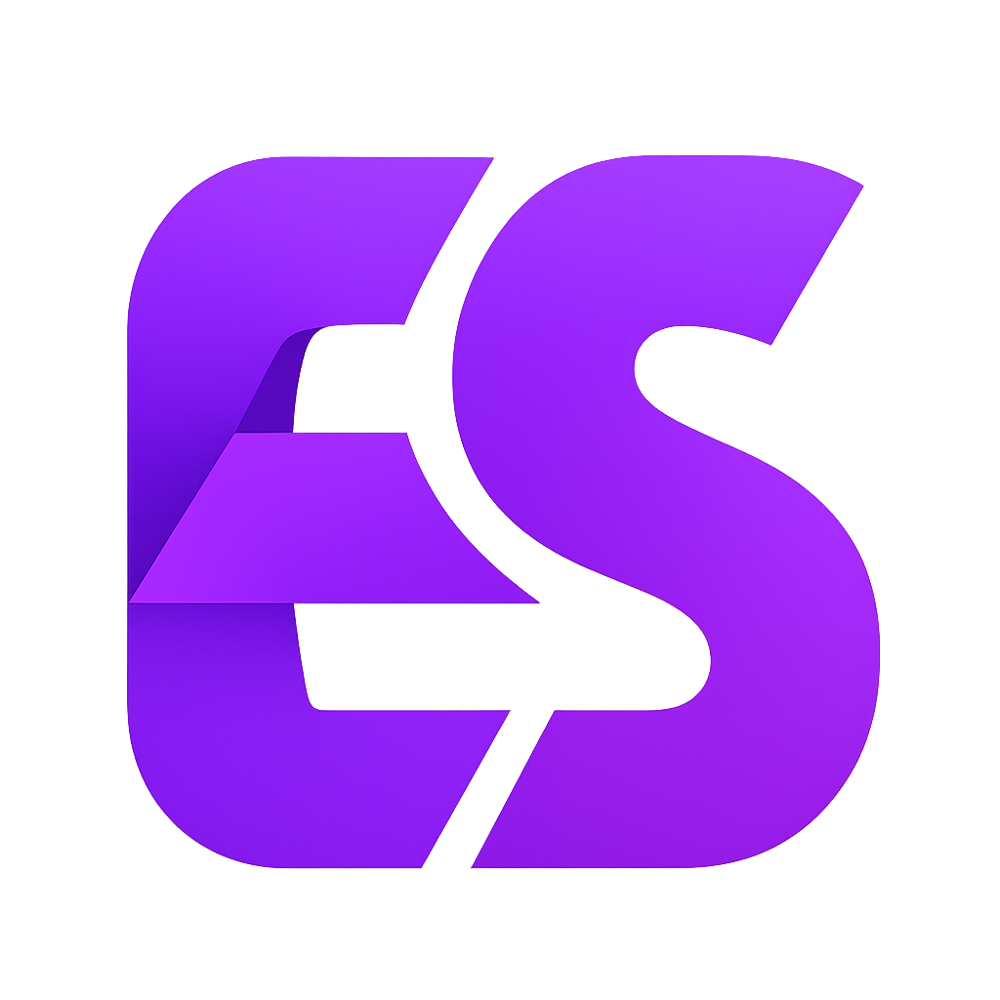

# 📕 Enhanced Quest

<p align="center">
  
</p>

<p align="center">
  <a href="https://discord.gg/YaAck7QkKX">
    
  </a>
</p>

This resource is built with performance, stability, and customization in mind, giving your server powerful new features right out of the box.  

---

## 🎥 Preview

<p align="center">
  <a href="https://youtu.be/xMhWsDMIHQc">
    
  </a>
</p>

---

## ✨ Features
- Optimized for **low performance impact**
- Easy to **configure & customize**
- Actively **maintained & supported**
- Plug-and-play installation


---

## 📥 Installation
1. Download or clone this repository into your `resources` folder.
2. Rename the folder (if needed) to match your resource name.
3. Add the following line to your `server.cfg`:
   ```cfg
   ensure ec-quest
